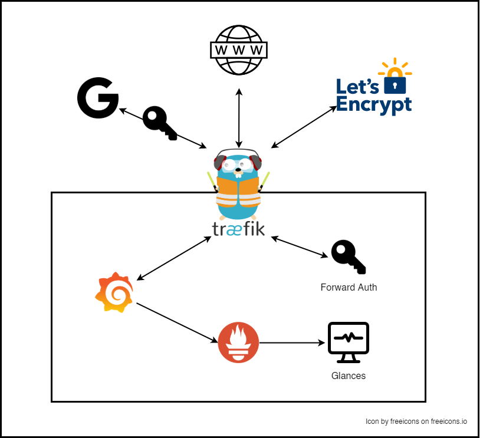
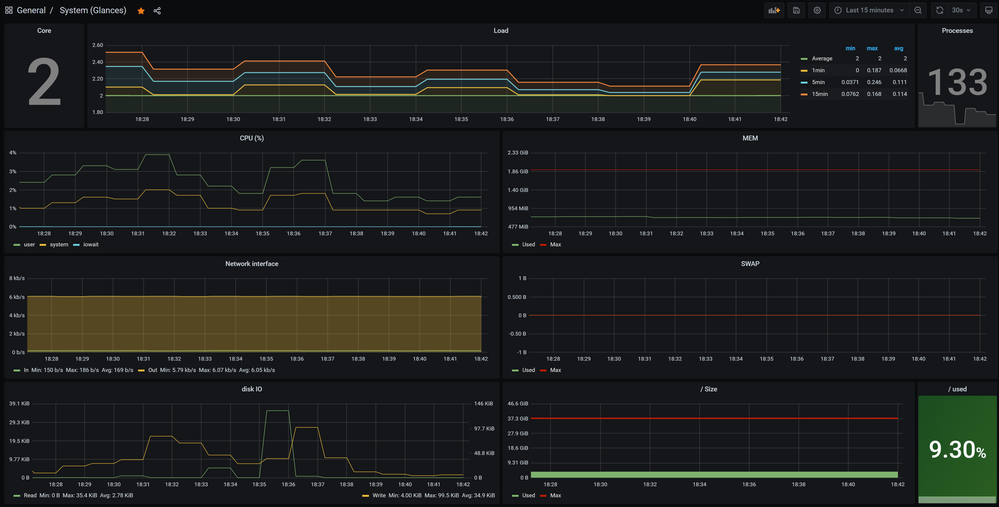

# Proxy Hosting Template

During setup for a new project of mine, I need to setup some infrastructure for host monitoring and a reverse proxy with auth.
This all will be realized in docker to have as less dependencies as possible.

( 💭 Better name pending.... )

## Requirements on the system

I will use that repository on linux based hosts und require a full docker and docker-compose installation on it.
Instructions to install docker can be found [here](https://docs.docker.com/engine/install/#server).

## Endpoints

🔒️ means its authenticated with a Google login and the email whitelist.

### Traefik

Public http port: `80`

Public https port: `443`

Traefik Dashboard (🔒️): `https://<host>/traefik/dashboard/` (Don't forget the last slash)

Ping: `https://<host>/ping`

### Grafana

Dashboards (🔒️): `https://<host>/grafana`

## Architecture



The architecture includes [Glances](https://github.com/nicolargo/glances) to monitor the system conditions.
It offers a prometheus interface which will be scraped by (obviously) Prometeus.
Which will be accessed by a Grafana installation, which is available from the outside.
To allow access to the services included and others as well Traefik manages the http(s) ports.

In this template traefik authenticate the endpoints with the Google auth.
(Should be GitHub Auth but thats not supporting whitelisting right now)
So when accessing protected services the user is asked to login into their google account first.

## Traefik Setup

As reverse proxy [Traefik](https://doc.traefik.io/traefik/) is used.
With its label-based configuration it's easy to extend it to services outside of this repository.

### Forward Auth

With a little companion container traefik can protect any endpoint in an very easy way.
The auth middleware is named `google-auth` and can be used at any other endpoint.
When used the access needs to be authenticated to proceed.

The internal dashboard is secured by it as well as Grafana via the `X-Forwarded-User` header.

### Let's Encrypt

For Let's Encrypt certificates an email and a (sub)domain are required. Both need to be specified at the `.env` file.
If you don't want to use Let's encrypt remove all lines of the traefik service containing `letsencrypt`.

### Include other services to Traefik

To include other docker container in the reverse proxy, make sure those container are in the `proxy` docker network and add those labels to the running container (Code from grafana for example):

```yaml
traefik.enable=true
traefik.http.routers.grafana.rule=PathPrefix(`/grafana`) # The rule needs to be adjusted to your needs. For more see https://doc.traefik.io/traefik/routing/routers/#rule
traefik.http.routers.grafana.entrypoints=websecure # This specifies that the container is available over the https entrypoint.
traefik.http.routers.grafana.middlewares=google-auth # This enables the forward authentication for the container. With it only authenticated users can access your service.

```

## Grafana



Grafana will be provisioned with Prometeus and a basic dashboard to monitor the host system and all running docker container.

## Configuration

All the configuration for secrets and options is contained in a `.env` file at the repository root folder.
To start your config use the `.env.sample` file, which contains all the used properties.

## Disclaimer

The setup here will be provided without any security warranty.
Make sure for yourself that everything is secured and whitelisted users have the correct rights.